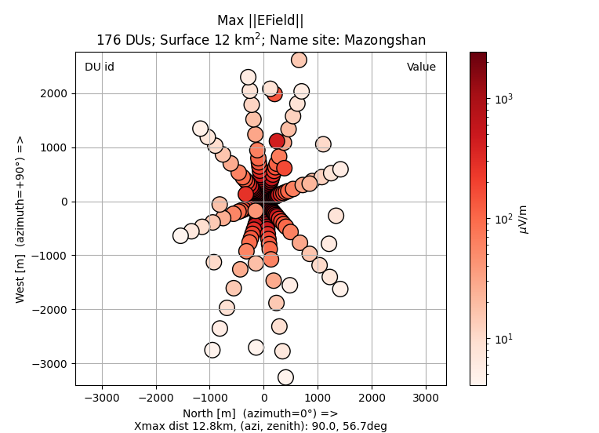

# RadioShower

** Prelimary version **

** Work in progress **

## Installation

```bash
$ pip install git+https://github.com/luckyjim/RadioShower.git
```

## Python library

```python
import rshower
```

## Script 

### zhaires_view.py

Read [ZHAireS](http://aires.fisica.unlp.edu.ar/zhaires/) simulation in HDF5 or text file format.

Interactive footprint plot:  
* traces, power spectrum density
* name of station, max EField value
* information on simulation : site, Xmax distance, direction



#### help 

```bash
$ zhaires_view.py -h
usage: zhaires_view.py [-h] [-f] [--time_val] [-t TRACE] [--trace_image] [--list_du] [--dump stationMP] [-i] path

Information and plot event/traces

positional arguments:
  path                  path of ZHAireS single event simulation

options:
  -h, --help            show this help message and exit
  -f, --footprint       interactive plot (double click) of footprint, time max value and value for each station
  --time_val            interactive plot, value of each station at time t defined by a slider
  -t TRACE, --trace TRACE
                        plot trace x,y,z and power spectrum of detector unit (station)
  --trace_image         interactive image plot (double click) of norm of traces
  --list_du             list of identifier of station
  --dump DUMP           dump trace of station
  -i, --info            some information about the contents of the file
```

