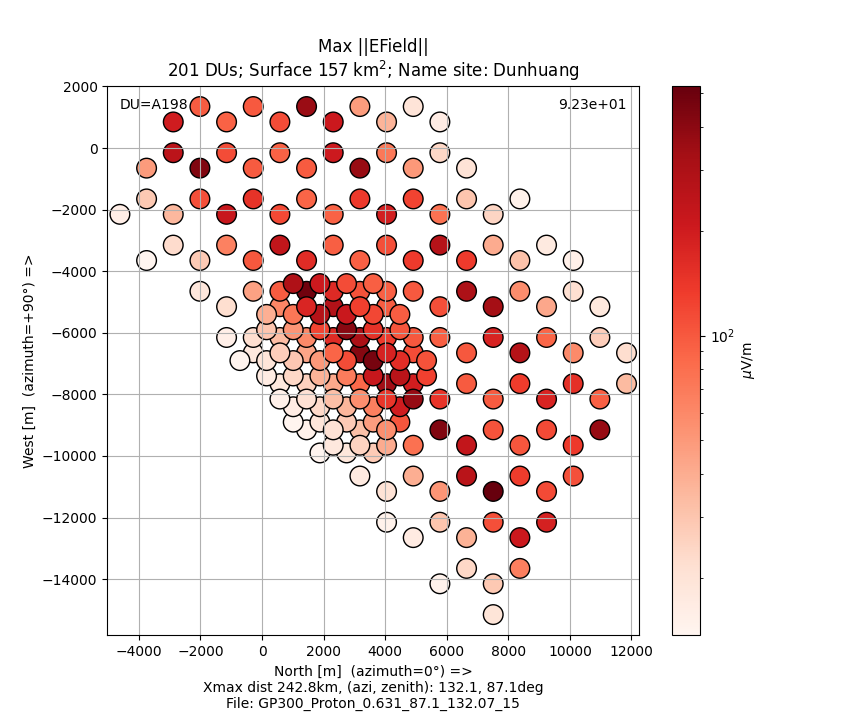
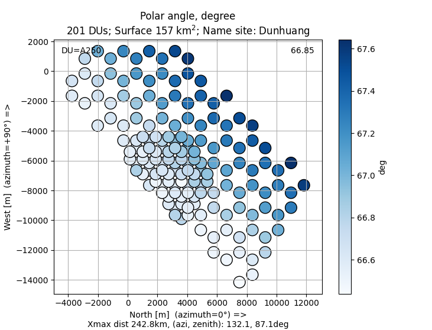

# RadioShower

** Prelimary version **

** Work in progress **
## Installation


upgrading pip and setuptools packages can help

```
pip install --upgrade setuptools pip
```

then with pip install

```
python -m pip install git+https://github.com/luckyjim/RadioShower.git 
```

## Update version

```
python -m pip uninstall RadioShower
python -m pip install git+https://github.com/luckyjim/RadioShower.git 
 ```

## Python library

```python
In [1]: import rshower.io.shower.zhaires_master as zm

In [2]: zhsim=zm.ZhairesMaster('/path/to/zhaires/sim/xxxx_Iron_0.0318_75.2_322.7_12881')

In [3]: zhsim.get_simu_info()
Out[3]: 
{'t_sample_ns': 0.5,
 'x_max': {'alt': 14.71636,
  'dist': 51.7913,
  'x': 39.81567,
  'y': -30.35338,
  'z': 14.52008},
 'sl_depth_of_max': {'unit': 'g/cm2', 'mean': 556.502},
 'ground_altitude': {'alt': 1.264, 'unit': 'km'},
 'vers_aires': '19.04.08',
 'vers_zhaires': '1.0.30a',
 'primary': 'Fe^56',
 'site': {'name': 'Xiaodushan', 'lat': 40.99, 'lon': 93.94},
 'geo_mag1': {'norm': 56.482, 'unit': 'uT'},
 'geo_mag2': {'inc': 61.6, 'dec': 0.13},
 'energy': {'value': 31.81, 'unit': 'PeV'},
 'shower_zenith': 75.17,
 'shower_azimuth': 322.68}

In [4]: tr3d = zhsim.get_object_3dtraces()

In [5]: tr3d.network.get_surface()
Out[5]: 32.9
```

## Script 

### zhaires_view.py

Read [ZHAireS](http://aires.fisica.unlp.edu.ar/zhaires/) simulation in HDF5 or text file format.

Interactive footprint plot:
* for max EField value  or polarization angle 
* traces, power spectrum density
* name of station
* information on simulation : site, Xmax distance, direction





#### help 

```bash
$ zhaires_view.py -h
usage: zhaires_view.py [-h] [-f] [--time_val] [-t TRACE] [--trace_image] [--list_du] [--dump stationMP] [-i] path

Information and plot event/traces

positional arguments:
  path                  path of ZHAireS single event simulation

options:
  -h, --help            show this help message and exit
  -f, --footprint       interactive plot (double click) of footprint, time max value and value for each station
  --time_val            interactive plot, value of each station at time t defined by a slider
  -t TRACE, --trace TRACE
                        plot trace x,y,z and power spectrum of detector unit (station)
  --trace_image         interactive image plot (double click) of norm of traces
  --list_du             list of identifier of station
  --dump DUMP           dump trace of station
  -i, --info            some information about the contents of the file
```
 